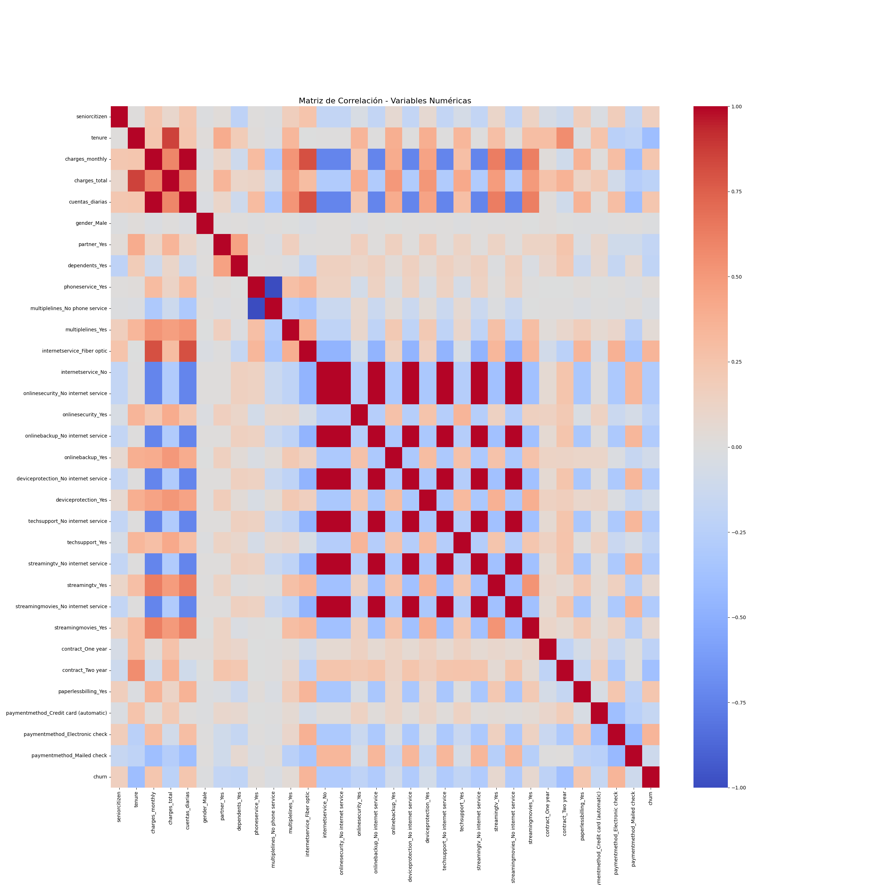
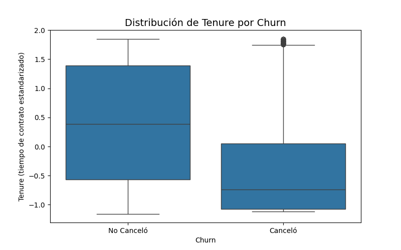
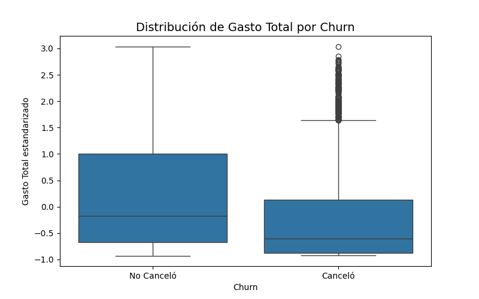
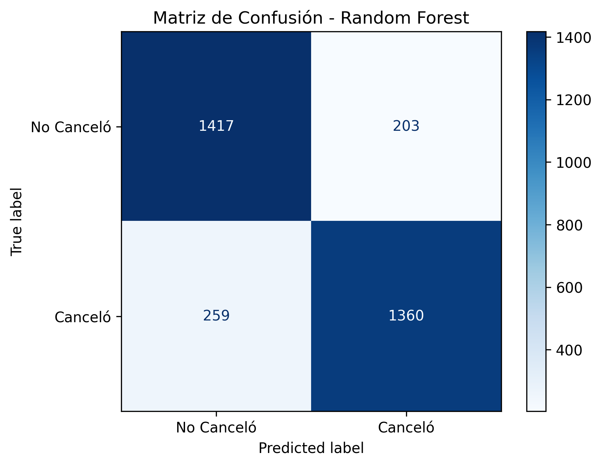

# 📑 Informe Final: Predicción de Cancelación de Clientes (Churn) – Telecom X
**Autor:** Henry Valdez  
**Fecha:** 31/07/2025

---

## 1. Introducción

El presente informe documenta el **Reto Telecom X – Parte 2**, cuyo objetivo es **predecir la cancelación de clientes (churn)** para una empresa de telecomunicaciones.  
El análisis comprende **cuatro etapas principales**:

1. Preparación de los Datos  
2. Correlación y Selección de Variables  
3. Modelado Predictivo  
4. Interpretación y Conclusiones  

Se emplearon **Python, pandas, scikit-learn, imbalanced-learn, Matplotlib y Seaborn** para el procesamiento de datos, balanceo de clases, construcción de modelos y generación de visualizaciones.

---

## 2. Preparación de los Datos

Se realizaron los siguientes pasos:

- **Carga y limpieza:** Eliminación de columnas irrelevantes como `customerid`.  
- **Codificación categórica:** Transformación con *One-Hot Encoding*.  
- **Tratamiento de nulos:** Imputación de valores faltantes con la **mediana** para variables numéricas.  
- **Balanceo de clases:** Uso de **SMOTE** para equilibrar las clases, dado que inicialmente los clientes no cancelantes eran el 74.3% y los cancelantes el 25.7%.  

**Dimensiones finales tras preprocesamiento:**

- `X`: (10796, 31)  
- `y`: (10796,)  

---

## 3. Correlación y Selección de Variables

### 3.1 Matriz de Correlación

Se generó una matriz de correlación para identificar las variables con mayor relación con la cancelación (`churn`):

**Top 5 variables más correlacionadas con `churn`:**

| Variable                           | Correlación |
|------------------------------------|-------------|
| tenure                              | 0.4036 |
| contract_Two year                   | 0.3871 |
| internetservice_Fiber optic         | 0.3510 |
| paymentmethod_Electronic check      | 0.3466 |
| onlinebackup_No internet service    | 0.2906 |

---

### 3.2 Análisis Dirigido

Se analizó cómo ciertas variables se relacionan con la cancelación.  
Por ejemplo:

- **Tiempo de contrato (Tenure)**: Los clientes que cancelan suelen tener **menos antigüedad**.  
- **Gasto total (Charges Total)**: Los clientes que cancelan tienden a tener **gastos acumulados menores**, reflejando su menor permanencia.

| Distribución de Tenure por Churn | Distribución de Gasto Total por Churn |
|---------------------------------|--------------------------------------|
|  |  |

**Análisis:**

- Los clientes **fieles** tienen contratos más largos y mayor gasto acumulado.  
- Los clientes **nuevos o de baja permanencia** concentran la mayoría de las cancelaciones.

---

## 4. Modelado Predictivo

Se construyeron **dos modelos supervisados**:

1. **Regresión Logística (normalizada)**  
2. **Random Forest (sin necesidad de normalización)**

Se dividieron los datos en **70% entrenamiento y 30% prueba**.  
Métricas principales:

| Modelo                 | Accuracy | Precision | Recall | F1-score |
|------------------------|---------:|---------:|------:|--------:|
| Regresión Logística    | 0.764    | 0.744    | 0.805 | 0.774 |
| Random Forest          | 0.857    | 0.870    | 0.840 | 0.855 |

**Conclusión intermedia:**  
**Random Forest** ofrece un **mejor equilibrio entre precisión y recall**, siendo el modelo más recomendable para producción.

---

## 5. Interpretación y Conclusiones

### 5.1 Variables Más Relevantes

**Importancia según Random Forest:**

Top 5 variables clave:

1. `charges_total` (Gasto Total)  
2. `tenure` (Tiempo de Contrato)  
3. `paymentmethod_Electronic check`  
4. `cuentas_diarias`  
5. `charges_monthly` (Gasto Mensual)

---

**Efectos identificados:**

- **Mayor riesgo de churn:**  
  - Clientes con **Fibra Óptica**  
  - **Pago con Electronic Check**  
  - Usuarios que consumen **StreamingTV y Películas**

- **Mayor retención:**  
  - Clientes con **contratos de 1 o 2 años**  
  - **Mayor antigüedad (tenure alto)**  
  - **Cargos mensuales más altos**, que reflejan servicios premium

---

### 5.2 Conclusiones Estratégicas

1. **Fomentar contratos a largo plazo**: Reducen significativamente el churn.  
2. **Promociones de retención** para clientes con pago electrónico y fibra óptica.  
3. **Identificar clientes nuevos** como el grupo de mayor riesgo.  
4. **Random Forest** es el modelo más confiable con F1 ≈ 0.85.

---

## 6. Cierre

El modelo permite **predecir la cancelación de clientes con alta precisión** y facilita estrategias de retención enfocadas en:

- **Clientes con baja antigüedad**  
- **Métodos de pago electrónicos**  
- **Servicios de fibra óptica y streaming**

**Siguiente paso:** Integrar el modelo en un sistema de alertas para anticipar cancelaciones.

---
